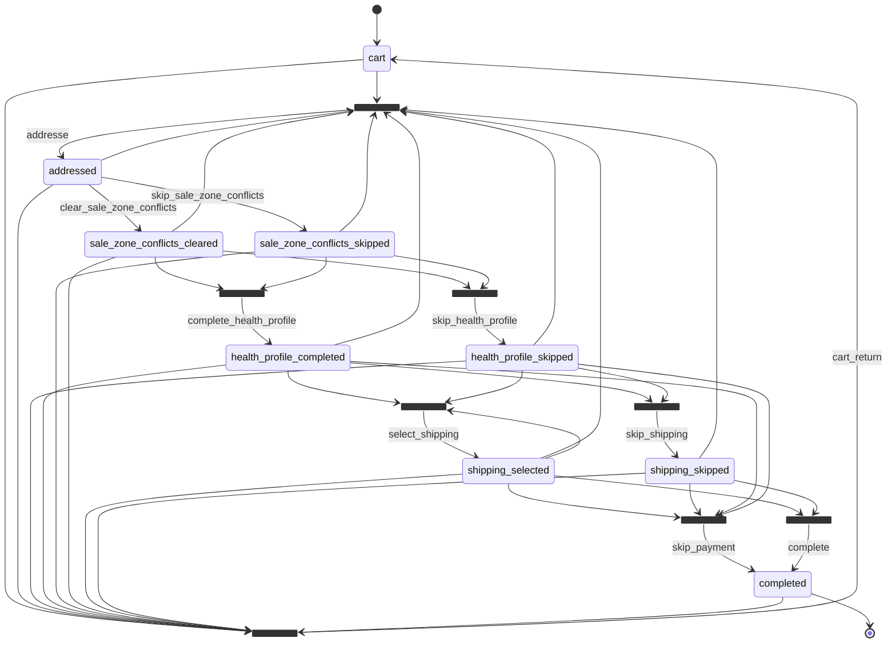

<PagesComponent/>
<ReferenceComponent>8-10</ReferenceComponent>

    <h1>Mission</h1>
    
Alerte commande 0€ et commande à 0€

    <h4>introduction</h4>

```mermaid {theme: 'neutral', scale: 0.35}
   stateDiagram-v2
    [*] --> cart
    state join_state1 <<join>>
    cart --> join_state1
    addressed --> join_state1
    health_profile_skipped --> join_state1
    health_profile_completed --> join_state1
    sale_zone_conflicts_skipped --> join_state1
    sale_zone_conflicts_cleared --> join_state1
    shipping_selected --> join_state1
    shipping_skipped --> join_state1
    completed --> join_state1
    join_state1 --> cart: cart_return
    completed -->[*]

    state join_state2 <<join>>
    cart --> join_state2
    addressed --> join_state2
    health_profile_skipped --> join_state2
    health_profile_completed --> join_state2
    sale_zone_conflicts_skipped --> join_state2
    sale_zone_conflicts_cleared --> join_state2
    shipping_selected --> join_state2
    shipping_skipped --> join_state2
    join_state2 --> addressed: addresse 

    addressed --> sale_zone_conflicts_skipped: skip_sale_zone_conflicts
    addressed --> sale_zone_conflicts_cleared: clear_sale_zone_conflicts

    state join_state4 <<join>>
    sale_zone_conflicts_cleared --> join_state4
    sale_zone_conflicts_skipped --> join_state4
    join_state4 --> health_profile_skipped: skip_health_profile

    state join_state5 <<join>>
    sale_zone_conflicts_cleared --> join_state5
    sale_zone_conflicts_skipped --> join_state5
    join_state5 --> health_profile_completed: complete_health_profile

    state join_state6 <<join>>
    health_profile_completed --> join_state6
    health_profile_skipped --> join_state6
    join_state6 --> shipping_skipped: skip_shipping

    state join_state3 <<join>>
    shipping_selected --> join_state3
    health_profile_completed --> join_state3
    health_profile_skipped --> join_state3
    join_state3 --> shipping_selected: select_shipping

    state join_state7 <<join>>
    shipping_selected --> join_state7
    shipping_skipped --> join_state7
    health_profile_completed --> join_state7
    health_profile_skipped --> join_state7
    join_state7 --> completed: skip_payment
    
    state join_state8 <<join>>
    shipping_selected --> join_state8
    shipping_skipped --> join_state8
    join_state8 --> completed: complete
    

```

